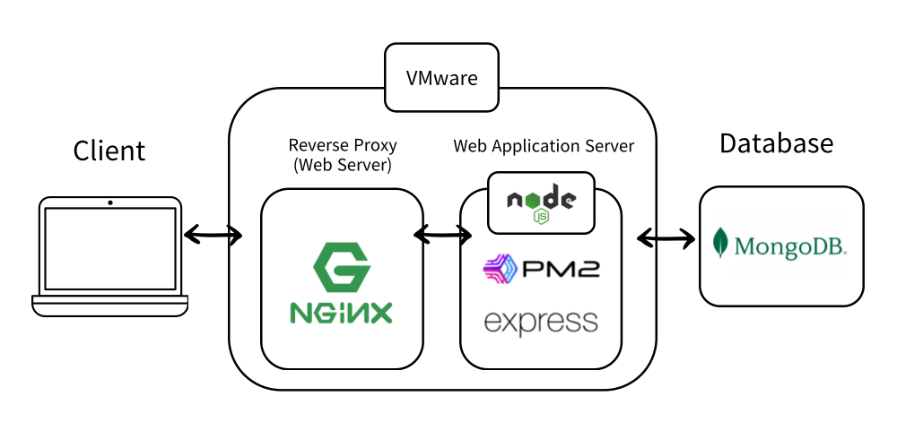

# 온라인 서점  [ Eladin ] 

---

<div align="middle">  </div><br>


## 프로젝트 주제

- 목적 : 필요한 책들을 찾아보고 간편하게 구매할 수 있게 하는 유저 서비스를 제공합니다.
- 목표
  - 홈에서 엘라딘 베스트 셀러, 추천 도서 등 유저에게 유용한 서비스를 제공합니다.
  - 회원 가입을 하지 않아도 마이페이지를 제외한 모든 기능을 이용할 수 있습니다.
  - 상품 조회부터 구매까지 짧은 프로세스로 유저가 빠져들게 합니다.

## 페르소나

💡 John Doe (존 도씨, 오타쿠) : <strong>"책을 사고 싶어요. 근데 나가기가 너무 귀찮은걸요?"</strong>

<div align="middle">  </div><br>
<br />

## 서비스 소개

#### 상품 등록, 장바구니 추가, 주문하기 등 쇼핑몰의 핵심 서비스를 구현합니다.

1. 회원가입, 로그인, 회원정보 수정 등 **유저 정보 관련 CRUD**
2. **상품 목록**을 조회, **상품 상세 정보**를 조회 가능함.
3. 상품 목록, 상세 페이지, 장바구니 어디서든 **주문 페이지** 로 연결하여 구매가 가능함.
4. 장바구니에서 주문, 바로 결제 버튼으로 **주문 완료 후 회원만 마이페이지에서 조회 및 삭제**가 가능함.
5. 장바구니는 서버 DB가 아닌, 프론트 단에서 저장 및 관리됨 (indexedDB).
6. **회원, 비회원, 게스트** 유저 모두 원하는 키워드를 검색하여 상품 조회가 가능함.

<br />


## 데모 사이트

- https://www.eladin.store

## API 설계 문서
- 

## 기술 스택


</br>
</br>
</br>


## Infra

<div align="middle">  </div><br>

<br/>

<br />

## 🚀 구성원 역할

<br />

| 이름              | 담당 |
| ----------------------- | --------- |
| :dog: 안동현      | FE (팀장) |
| :tiger: 박지원 | BE        |
| :cat: 권성경    | FE        |
| :mouse: 박정민    | FE        |
| :dolphin: 김희산    | BE        |

### 프론트엔드
- **Vanilla Javascript**, HTML, CSS
- Font-Awesome
- Goole-fonts
- animate.css
- swiper.js
- 카카오(다음) 주소 API
#### 역할
- :dog: 안동현
    - 페이지 레이아웃, 회원가입 유효성 검사, 로그인, 검색 기능 등
- :cat: 권성경
    - 페이지 레이아웃, 모달 창, DAUM 주소 api, 회원가입 유효성 검사 등 
- :mouse: 박정민
    - 페이지 레이아웃, 장바구니(Indexed DB) 등

### 백엔드
- **Nodejs + Express** 
- dotenv,cookie-parser,cors
- jsonwebtoken,uuid
- bcrypt
- mongoose
- multer
#### 역할
- :tiger: 박지원
    - Dummy Data 수집 -kakao 도서검색 API 구현
    - 유저,상품,주문 스키마 작성 및 모델 구현
    - 로그인 중복 검사 API 구현
    - 비회원 인증 API 구현
    - 상품,주문 API구현
    - 비회원 uuid 유효성 검사 미들웨어 구현
- :dolphin: 김희산
    - 서버 구축 및 데이터베이스 연결(mongoDB)
    - 회원가입,로그인 API 구현
    - JWT 유효성검사 미들웨어 구현
    - 이미지 업로드 미들웨어 구현
    - VM 배포,Nginx 라우팅,도메인 연결


### Collaboration Tools

- Notion : 수정이 빈번하고 같이 수정해야하는 것, API 명세
- Discord : 화상회의 , 수시로 스크럼 잡는 용도
- Gitlab : Code Repository
- Gitlab Issue : 진행상황이나 Trouble Shooting 내역 적기
- Postman Teams : API 테스트 진행


### 코드 컨벤션

- CSS 클래스명은 `-` 으로 표시
- 파일명이 여러 단어로 이루어지면 ‘- (하이픈)’ 으로 연결하기
- 변수명 Camel Case
- 함수명 동사로시작
- Prettier 라이브러리 적용
- dotenv 라이브러리로 환경변수 관리 및 사용
- 객체지향,함수형 프로그래밍 패러다임

### Commit 컨벤션

- create: 파일 생성
- feat: 새로운 기능
- fix: 수정 사항
- style : 주석 제거 등 기존 코드에 영향이 없을 때.
- delete: 파일 삭제


<br />

### 배포

- GCP에서 VM 인스턴스를 생성
- Nginx를 설치하고, 설정하여 웹 서버로 활용
- Gabia Domain, Goole Domain을 구입하여, DNS 설정을 통해 도메인과 VM 인스턴스를 연결
- Let's Encrypt에서 무료 SSL 인증서를 발급받아 Nginx 웹 서버에 적용하여 HTTPS 프로토콜을 지원하도록 설정

### 실행 방법

```bash
git clone {.....repository_name}.git
cd {repository_name}}
npm install
npm run start
```

### .env 설정

```
BCRYPT_SALT_ROUNDS={BCRYPT_SALT_ROUNDS}
PORT={PORT}
DB_HOST={DB_HOST}
DB_NAME={DB_NAME}
ACCESS_TOKEN_SECRET={ACCESS_TOKEN_SECRET}
REFRESH_TOKEN_SECRET={REFRESH_TOKEN_SECRET}
REFRESH_TOKEN_EXPIRES_IN={REFRESH_TOKEN_EXPIRES_IN}
ACCESS_TOKEN_EXPIRES_IN={ACCESS_TOKEN_EXPIRES_IN}
```

### Copyright

Copyright © Eladin All Rights Reserved


---

본 프로젝트에서 제공하는 모든 코드 등의는 저작권법에 의해 보호받는 ㈜엘리스의 자산이며, 무단 사용 및 도용, 복제 및 배포를 금합니다.
Copyright 2023 엘리스 Inc. All rights reserved.
